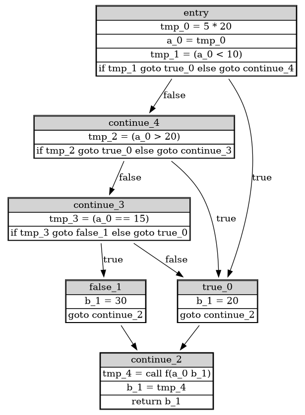

# latte compiler

## Description

- front-end
- back-end LLVM
- using SSA LLVM representations with registers and phi instead of alloc w LLVM
- optimizations
  - LCSE/GCSE
- extensions
  - arrays
  - structures

## Example program
```
int main() {
  int a, b;
  a = 5 * 20 ;

  if (a < 10) {
    b = 20 ;
  } else {
    if (a > 20) {
      b = 20 ;
    } else {
      if (a == 15) {
        b = 30 ;
      } else {
        b = 20 ;
      }
    }
  }

  b = f(a, b) ;

  return b ;
}
```

**Example intermidiate representation graph:**


## Building the project

To build the `latc` executable files, run the following command:
```bash
make
```

### Under the hood

Under the hood, the `Makefile` uses `cabal` to build the project with `cabal build`. 
Cabal looks for `latte.cabal` file for the configuration. 

The project is written 
with `stack` tool, so you can also use:
```bash
stack build
stack exec latc-llvm
```
To build and run the `latc` executable.

### Creating archive

In the main directory, run:
```
make archive
```

### Directories

- `app` - contains the haskell code for the main function of `latc` (just the CLI interface)
- `src` - contains the code for the compiler
- `package.yaml` - the package file for the project
- `stack.yaml` - the stack file for the project
- `Makefile` - the makefile for the project
- `bnfc.cf` - the BN grammar for the latte language

## Notes

Adding in `package.yaml`:
```bash
    other-modules:       []
```
to fix GHC errors with main module not being found.

To get the parser, run:
```bash
bnfc -d -o output -m --functor bnfc.cf
```

Then to compile you have to add `-package array` to ghc options in Makefile, because by default the "array" is implicit.

Commands for jasmin and llvm:

- `java -jar lib/jasmin.jar -d <output dir> <path to jasmin bc>`
- `lli <path to llvm bc>`

```
llvm-as -o foo.bc foo.ll
llvm-link -o out.bc foo.bc runtime.bc
lli out.bc
```

Commands for debug run:

```
stack build --profile && stack exec --profile latc_llvm -- lattests/mine/good/mix.lat  +RTS -p
```