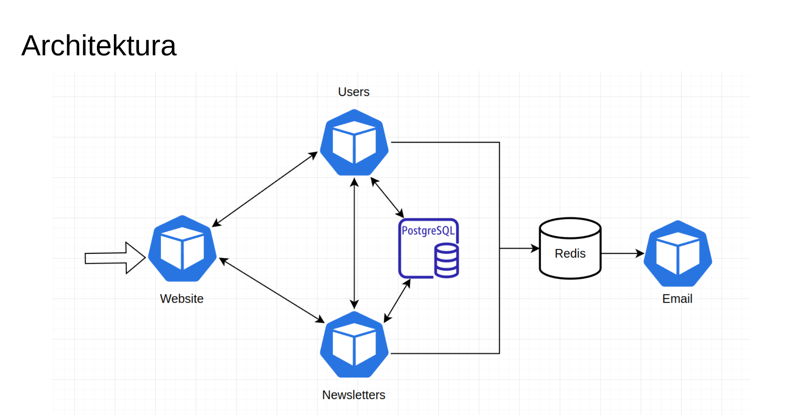

# Newsletter Manager

Project for the completion of the JNP2 course "Microservices Architecture and Infrastructure in Web Applications" at the University of Warsaw.

## Description

The system is divided into the following microservices:

- `newsletters` - a service managing newsletters using a REST API
- `users` - a service managing users and authentication
- `email` - a service sending emails with newsletters, utilizing a Redis queue
- `website` - a service providing the frontend of the application

The backend services are written in Go, and the website is developed using the Next.js framework. It employs server-side rendering for generating static pages, ensuring greater security and reduced latency.

The entire system is containerized with Docker and configured to run in a Kubernetes environment. For this project, a cluster was created on the Google Cloud Platform.

Communication occurs in two ways: synchronously through REST API and asynchronously through a Redis-based queue. Additionally, a PostgreSQL database is used for persistent data storage.

<!-- add image from networking/architecture.png -->
