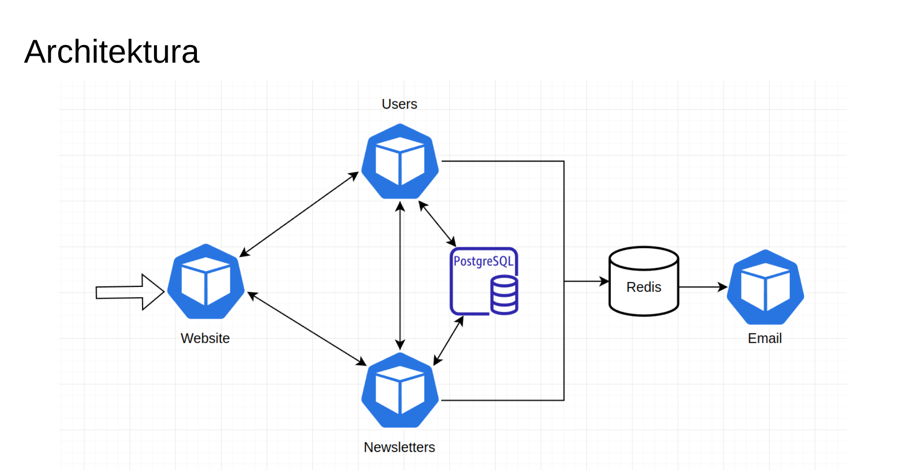

# Newsletter manager

Projekt na zaliczenie kursu JNP 2 "Architektura i infrastruktura mikroserwisów w aplikacjach internetowych" na UW.

## Opis

System jest podzielony na następujące mikroserwisy:

- `newsletters` - serwis zarządzający newsletterami za pomocą REST API
- `users` - serwis zarządzający użytkownikami oraz autoryzacją
- `email` - serwis wysyłający maile z newsletterami, wykorzystuje kolejnę Redis
- `website` - serwis dostarczający frontend aplikacji 

Serwisy backendowe są napisane w języku Go, a strona internetowa we frameworku Next.js. Wykorzystuje ona generowanie statycznych stron po stronie serwera, co zapewnia większe bezpieczeństwo oraz mniejsze opóźnienie.

Całość jest zdockeryzowana oraz skonfigurowana do uruchomienia w środowisku Kubernetes. Na potrzeby projektu został utworzony klaster w Google Cloud Platform.

Komunikacja odbywa się na dwa sposoby: synchronicznie za pomocą REST API oraz asynchronicznie za pomocą kolejki na bazie danych Redis. Ponadto do przechowywania trwałych danych wykorzystywana jest baza danych PostgreSQL.

<!-- add image from networking/architecture.png -->
